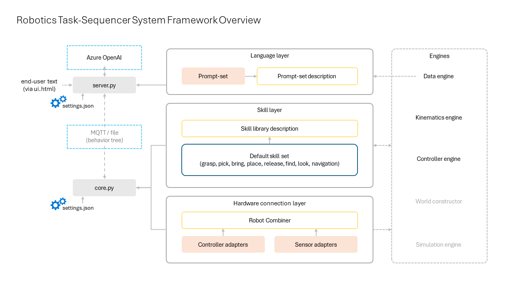

# Robotics Task-sequencer System Framework

The Robotics Task-sequencer System Framework enables developers to achieve more complex robot systems where a robot is capable of changing operation patterns on-the-fly based on user instructions. The layered framework structure enables combining different development areas such as prompt-engineering, robotic skill development, and hardware integration while ensuring that the entire system runs as a whole.

The framework enables generating a sequence of robot actions (a behavior tree) from text input by a human operator using Azure OpenAI, and then connecting those actions to the robot controller. The framework is designed to adapt to different hardware of different forms including but not limited to dual-arm robots, dexterous hands, industrial manipulators, and mobile robots.



The above figure illustrates the overview of the framework. Dotted arrows indicate data flow while solid arrows indicate component loading. Components in a dotted blue outline may indicate dependency on an external service. Components in an orange outline or coloring may require implementation/replacement depending on the usage scenario.

## FAQ

Please note that the term "user(s)" below refers to the developers, engineers, etc. who will be directly using this repository and does not refer to the end-users.

<details>
<summary> What is/are the Task-sequencer System Framework’s intended use(s)? </summary>
The framework should be used to develop robot systems which turn human language into actions for robots. The repository containing the framework includes a sample code on how to adapt this framework, however, it is up to the users to implement the actual system and hardware integration to operate for their purpose.
</details> 

<details>
<summary> How was Task-sequencer System Framework evaluated? </summary>
The framework has been tested with several robots ranging from a humanoid to a four-legged robot. Instructions have been tested on a range of scenarios including daily chores, inspection, and assembly. These varying hardware and scenarios were used to test the applicability of the framework. Please note that the tested scenarios are not part of the repository, however, a user could apply the framework to such scenarios by customizing the prompts, skills, and hardware connections.
</details> 

<details>
<summary> What are the limitations of the Task-sequencer System Framework? How can users minimize the impact of the limitations when using the framework? </summary>
The framework is not designed to be used as-is for a robotics operation. Users must provide the appropriate prompts, skills, and hardware connections. The repository provides example prompts for a daily chore scenario with a default skill set including find, look, grasp, pick, bring, place, release, and navigation. While this sample prompt and default skill set may be used as-is for some use cases, users should build upon the samples and not rely on the sample implementations as if it is something reliable for a robotics operation.
</details> 

<details>
<summary> Is the Task-sequencer System Framework an end-to-end language-action model? </summary>
The framework is not an end-to-end language-action model but rather a layered framework to achieve a language-to-action pipeline. Instead of directly outputting low-level motor commands, the language input is converted to a sequence of high-level action commands (tasks) in the behavior tree format. This allows human-in-the-loop where a human operator may examine the generated sequence before low-level commands are sent to the robot.
</details> 

<details>
<summary> Does the Task-sequencer System Framework ensure safe executions? </summary>
The framework does not detect whether the generated sequence is safe to perform. It is highly recommended that the user checks and ensures that the generated sequence is safe by examining the generated behavior tree. Users should be prepared to emergency stop the robot if is behaving unexpectedly.
</details> 

<details>
<summary> What operational factors and settings allow for effective and responsible use of the Task-sequencer System Framework? </summary>
To increase the reliability of the sequence generation, it is recommended that a user edit the prompts. To achieve the hardware connections, a user with a good understanding about their hardware should implement the connection with extra consideration on the robot’s control speed and preferably use simulators until obtained reliable end-to-end system flows.
</details> 

<details>
<summary> Does the repository provide examples for real hardware connection? </summary>
The sample codes do not provide any examples that will connect to a specific  hardware. However, if using a ROS compatible robot, an example for connecting to a ROS controller is provided in the comments of the sim_robot_controller.py sample code.
</details> 

<details>
<summary> How can custom modules be integrated with the Task-sequencer System Framework? </summary> 
The framework relies on loading python modules for the prompt-set definitions, skills, and hardware connections. A user can load their own prompt-set definitions, skills, and hardware adapters by creating their own configuration files and by passing the right arguments when running the server.py and core.py (please see the Developing section for further details). It is highly recommended that users package their own modules and configurations in a separate repository/folder and avoid mixing their code with the code provided from this repository.
</details> 

<details>
<summary> Are the skills in the default skill set machine-learned / trained using datasets? What are the requirements for using the default skill set? </summary>
All the skills in the default skill set are engineered (non-trained) and require integrating sensors/controllers in the hardware connection layer to successfully generate a trajectory. While these skills require the hardware adapters to be correctly setup, they do not require additional data collection as they are not trained using data. However, data collection could be a requirement for the controller/sensor module the user decides to integrate (e.g., a sensor hardware integrated with Cognitive Services for object detection, etc.).
</details> 

<details>
<summary> What are the skill parameters and how are they obtained in the system? </summary>
In the generated behavior tree, skill parameters are indicated using name conventions starting with an "@" mark. For the default skill set, these parameters change the behavior of the trajectory generation. In the sample code and for the default skill set, a fixed value is loaded from an external JSON file. The repository does not provide an automated way of obtaining these parameters and it is recommended that a user develops the automated procedure for capturing these parameters based on the state of the environment. However, a tool using GPT-4o to automate the skill parameter collection for the default skill sets may be released as a separate repository in the future.
</details> 

## Getting Started

Please install the code and required packages in a Python environment. Below is an example of installing the code and packages in a new venv environment (the below is only an example, please follow appropriate install procedures for your Python environment).
```
py -3 -m venv .venv
.venv/Scripts/activate
pip install -r requirements.txt
pip install .
```

If using Visual Studio Code, don't forget to set the Python interpreter to the venv with ```Ctrl + Shift + P``` then "Select Interpreter".

To run the server.py, please also make sure you have [Azure OpenAI](https://azure.microsoft.com/en-us/products/ai-services/openai-service) ready under your subscription.

## Usage

The framework includes two running Python applications: the server and the core. The server generates a sequence of robot actions in the behavior tree format. The core runs the generated sequence to control the robot.

### 1. Running the server

To run the server, run the following command (this is a one-line command):

```
./src/tasqsym_encoder/server.py --credentials <CREDENTIALS_FILE> --aoai --aimodel tasqsym_samples.aimodel_samples.model.PickPlaceScenario --config ./src/tasqsym_samples/encoder_sample_settings.json --connection file
```

For the ```<CREDENTIAL_FILE>``` please create a file with the appropriate access settings to your Azure OpenAI resource.
```
AZURE_OPENAI_ENDPOINT=
AZURE_OPENAI_KEY=
AZURE_OPENAI_DEPLOYMENT_NAME_CHATGPT=
```

Once the server begins (shows ```INFO: Uvicorn running on http://localhost:9100``` in the terminal), open a web browser and connect to localhost:9100.

In the web browser UI, enter ```throw away the empty bottle``` in the text box and you should see a behavior tree corresponding to the text instruction generated in a few seconds. After confirming the generated content, enter ```Y``` in the text box and you should see the generated content saved into a file (tasqsym_encoder_output.json).

### 2. Running the core 

To run the core, run the following command (this is a one-line command):

```
./src/tasqsym/core.py --config ./src/tasqsym_samples/sim_robot_sample_settings.json --btfile ./src/tasqsym_samples/generated_sequence_samples/throw_away_the_trash.json --connection standalone
```

Once you run the core, you should see messages like ```runNode {'Node': 'FIND', '@target_description': 'empty_bottle', '@context': 'find the empty_bottle on the right'}``` and ```sending joint angles to the sim robot controller ...``` indicating that the behavior tree node is being parsed and as-if sending commands to the robot controller.

You may change the ```--btfile ``` to point to the file generated from the server by running ```--btfile ./tasqsym_encoder_output.json```.

### 3. Connecting the server and core

Instead of using generated files, the core can receive the generated sequence directly from the server by passing through MQTT. This can be done by changing the ```--connection ``` options to use ```--connection mqtt``` for both the server and client. You will need an [MQTT broker](https://learn.microsoft.com/en-us/azure/event-grid/mqtt-overview) setup to run with this option.

To run using MQTT, you will also need to edit the ```<CREDENTIAL_FILE>``` and include the following content:
```
MQTT_HOST_NAME=
MQTT_USERNAME=
MQTT_CLIENT_ID=
MQTT_CERT_FILE=
MQTT_KEY_FILE=
MQTT_TCP_PORT=
```

When running the core, make sure to remove the ```--btfile ``` option and instead pass a credential file for the core using ```--credentials <CREDENTIAL_FILE_CORE>```.

## Developing

The framework is designed so that users can develop and replace parts of the codes such as replacing prompts, replacing skills, replacing hardware connections with their own-developed (custom) modules. It is important to note that custom modules/configurations should be their own set of codes and separated from this repository as shown in the following diagram.

```
└── robotics-task-sequencer-system-framework
└── <custom_prompt_set>
    ├── setup.py
    └── src
        └── <custom_prompt_set>
             ├── __init__.py
             ├── my_model.py
             ├── prompt
             │      ├── action_prompt.txt
             │      ├── environment_prompt.txt
             │      ├── example_prompt.txt
             │      ├── output_prompt.txt
             │      └── role_prompt.txt
             ├── query
             │      └── query.txt
             ├── system
             │      └── system.txt
             └── my_settings_for_server.json
└── <custom_skill_library>
    ├── setup.py
    └── src
        └── <custom_skill_library>
            ├── __init__.py
            └── library
                ├── __init__.py
                ├── extended_library.py
                └── <custom_skill_name>
                    ├── __init__.py
                    ├── <custom_skill_name>.py
                    └── <custom_skill_name>.md
└── <custom_hardware_adapter>
    ├── setup.py
    └── src
        └── <custom_hardware_adapter>
            ├── __init__.py
            ├── my_combiner.py
            ├── my_robot_config.json
            ├── include
            │       ├── __init__.py
            │       ├── <robot_name>_model.py
            │       └── <robot_name>_controller.py
            └── my_settings_for_core.json
```

To properly set up the custom modules for the server, please create a settings.json with the right settings and pass the JSON file using the ```--config ``` argument. If you are using your own set of prompts, please specify the corresponding prompt-set description module (my_model.py) using the ```--aimodel ``` argument.

To properly set up the custom modules for the core, please create a settings.json with the right settings and pass the JSON file using the ```--config ``` argument. If you are using your own skill set, please make sure the path to the library list is correctly set in the settings.json. If you are using your own hardware connections (adapter implementations), please make sure the path to the adapters are correctly set in the settings.json.

## Contributing

This project welcomes contributions and suggestions.  Most contributions require you to agree to a
Contributor License Agreement (CLA) declaring that you have the right to, and actually do, grant us
the rights to use your contribution. For details, visit https://cla.opensource.microsoft.com.

When you submit a pull request, a CLA bot will automatically determine whether you need to provide
a CLA and decorate the PR appropriately (e.g., status check, comment). Simply follow the instructions
provided by the bot. You will only need to do this once across all repos using our CLA.

This project has adopted the [Microsoft Open Source Code of Conduct](https://opensource.microsoft.com/codeofconduct/).
For more information see the [Code of Conduct FAQ](https://opensource.microsoft.com/codeofconduct/faq/) or
contact [opencode@microsoft.com](mailto:opencode@microsoft.com) with any additional questions or comments.

## Trademarks

This project may contain trademarks or logos for projects, products, or services. Authorized use of Microsoft 
trademarks or logos is subject to and must follow 
[Microsoft's Trademark & Brand Guidelines](https://www.microsoft.com/en-us/legal/intellectualproperty/trademarks/usage/general).
Use of Microsoft trademarks or logos in modified versions of this project must not cause confusion or imply Microsoft sponsorship.
Any use of third-party trademarks or logos are subject to those third-party's policies.
